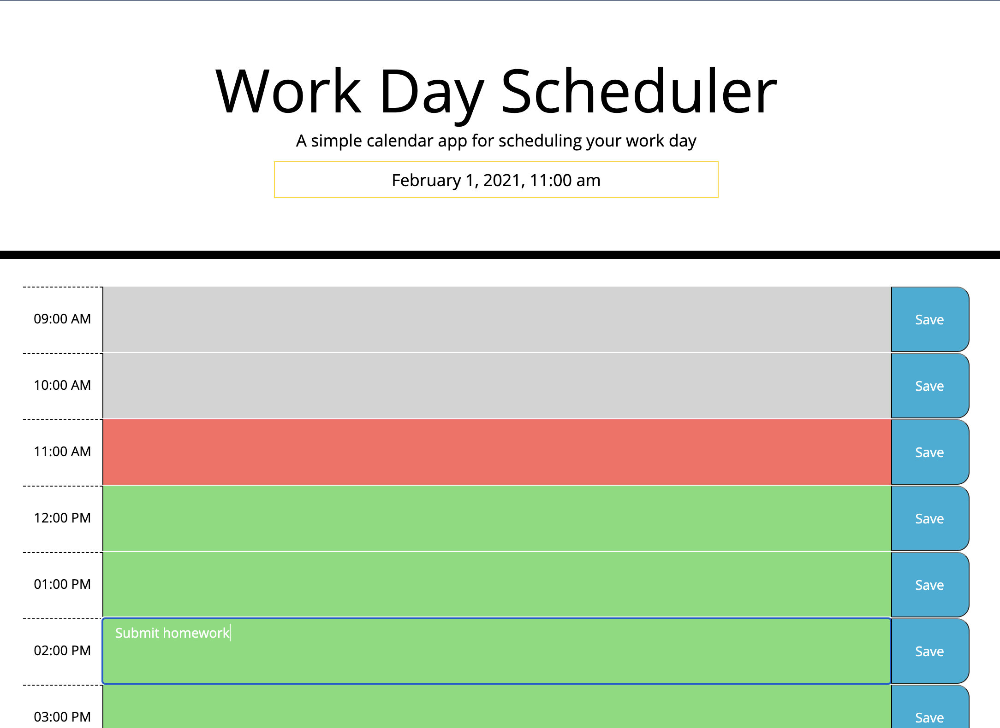

# Third-Party APIs: Work Day Scheduler | Jenn Greiner

### Table of Contents:
* [User Story](#user-story)
* [Description](#description)
* [Usage](#Usage)
* [Mock-Up](#Mock-Up)

[Work Day Scheduler](https://jenngreiner.github.io/Work-Day-Scheduler-homework5/)

## User Story
As a professional, I need a dynamic way to update and keep track of my daily schedule.

## Description 
This application allows users to view their 8-hour schedule for a given work day. The time slots are color coded for past, present, and future hours of the day. Tasks entered are saved to the scheduler, and persist when the user revists the page. 

## Usage
Open the [Work Day Scheduler](https://jenngreiner.github.io/Work-Day-Scheduler-homework5/) in your browser. Click on a text are for any given hour and enter a task, then click 'Save' for that hour slot. The color of the time lock will change as the day proceeds; past hours will be grey, the current hour will be red, and future hours will be green. 

## Mock-Up

The following image shows the work day scheduler's appearance and functionality:

## Credits
* https://www.w3schools.com/
* https://momentjs.com/
* https://developer.mozilla.org/
- - -